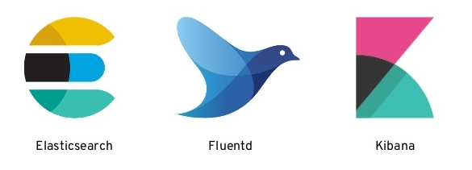

# The EFK stack

When running multiple services and applications, a centralized logging stack can help you quickly sort through and analyze the heavy volume of log data produced by these services and applications. The solution chosen here is the **E**lasticsearch, **F**luentd and **K**ibana (EFK) stack.

&NewLine;

[**Elasticsearch**](https://www.elastic.co/fr) is a multitenant-capable and distributed search engine which allows for full-text and structured search, as well as analytics. It is used to index and search through large volumes of log data.

[**Fluentd**](https://www.fluentd.org/) is a cross platform open-source data collection software to collect, transform, and ship log data to Elasticsearch.

[**Kibana**](https://www.elastic.co/fr/products/kibana) is an open source data visualization dashboard for Elasticsearch. It allows the user to visualize content indexed on Elasticsearch with a variety of graphs - bar, line, scatter plots, pie charts, etc, but also to search for logs in Elasticsearch.

In this stack, [**Grafana**](https://grafana.com/) is also used for the alerting (as this feature is no longer free in Kibana). Compared to Kibana, Grafana is only capable of visualization and not searching.

## Configuration

Elasticsearch, Kibana and Grafana are built from the docker-compose of the `ek` directory. Fluentd is built from the docker-compose of the `workers` directory.

Fluentd Dockerfile and configuration file are located respectively in `fluentd` and `fluentd/conf`.

By default, all services are launched in `localhost`.

### Ports

| Service   | Port |
|-----------|------|
| Elasticsearch  | 9200  |
| Fluentd        | 24224 |
| Kibana         | 5601  |
| Grafana        | 3000 |
